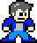
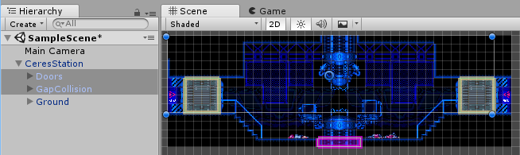

.. SuperTiled2Unity documentation master file, created by
   sphinx-quickstart on Thu Aug  9 09:18:53 2018.
   You can adapt this file completely to your liking, but it should at least
   contain the root `toctree` directive.

SuperTiled2Unity Documentation
============================================

   By `Sean Barton <http://www.seanba.com>`_

**SuperTiled2Unity** is a collection of Unity scripts that import files from the popular `Tiled Map Editor <https://www.mapeditor.org/>`_ in your Unity projects. It is available for download on `itch.io <https://seanba.itch.io/supertiled2unity>`_.
The goal of SuperTiled2Unity is that **it just works**. Except for the most specialized cases users should be able to quickly and easily add tile-based 2D content to their Unity projects.

SuperTiled2Unity is currently distibuted as a Unity Package at any price you choose (including free).
Additional `donations can be made <http://www.seanba.com/donate>`_ and **are always appreciated**.

.. toctree::
   :maxdepth: 2
   :caption: User Manual
   
   manual/sorting
   manual/custom-properties
   manual/custom-properties-importing
   manual/extending-the-importer
