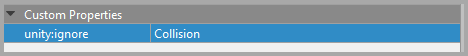

Custom Properties for Importing
===============================

You can customize how some portions of your Tiled files are imported into Unity prefabs through special custom properties.
These custom properties always have a :code:`unity:` prefix so that they do not collide with your own custom properties.

.. csv-table::
   :widths: auto
   :header: "Property Name", "Value Type", "Used On", "Purpose"

   ":code:`unity:ignore`", ":code:`string`", "Layers", "Portions of the Tiled layer can be ignored during the import process. This is useful if you want tiles to appear for a layer but not the colliders, for instance.

   Acceptable values:
      * **False**: The layer is imported in full (default)
      * **True**: The layer is fully ignored (same result as having the layer invisible in Tiled)
      * **Visual**: The tiles are not imported for the layer.
      * **Collision**: The colliders are not imported for the layer."
   ":code:`unity:IsTrigger`", ":code:`bool`", "Layers, Tileset, Tile, Collider, Collider Group", "Controls the :code:`isTrigger` setting of the :code:`Collider2D` object generated in the prefab. Add as a layer custom property to override all colliders for a given layer."
   ":code:`unity:layer`", ":code:`string`", "Layers, Tileset, Tile, Collider, Collider Group", "Controls which Unity phyisics layer our generated colliders are assigned. The layer name must exist in your project's Tag Manager."
   ":code:`unity:SortingLayer`", ":code:`string`", "Layers, Tile Objects", "Controls which sorting layer is assigned to the Unity :code:`Renderer` component created for your tilemaps and sprites. The sorting layer name must exist in your project's Tag Manager."
   ":code:`unity:SortingOrder`", ":code:`int`", "Layers, Tile Objects", "Controls which sorting order is applied to the Unity :code:`Renderer` component created for your tilemaps and sprites."
   ":code:`unity:Tag`", ":code:`string`", "Layers, Objects", "Controls which tag is applied to the :code:`GameObject` created for your layers and objects. The tag must exist in your project's Tag Manager."

