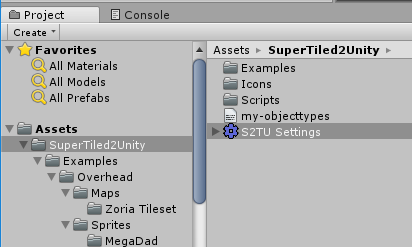
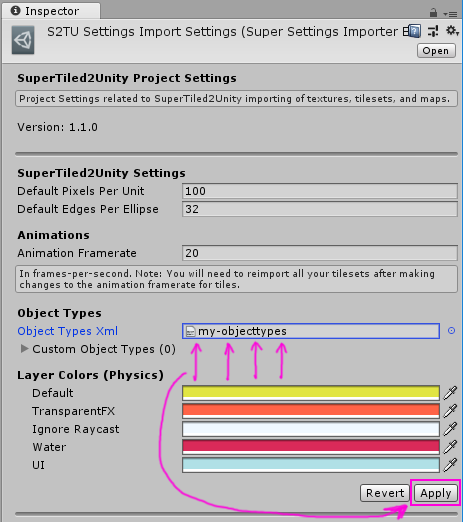
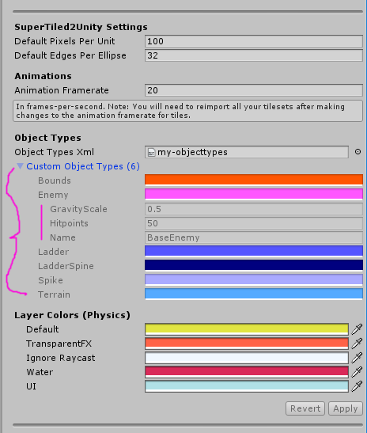

Custom Properties Support
=========================

TODO: Explain these images

.. figure:: img/objects-xml/object-types-editor.png
   :alt: Object Types Editor
   
   Object Types Editor

.. figure:: img/objects-xml/export-objects-types.png
   :alt: Export Object Types Xml
   
   Select **Export Object Types** from the File menu item

.. figure:: img/objects-xml/export-save-dialog.png
   :alt: Save Dialog
   
   Save Object Types Xml file to your Unity Project

   
   Select S2TU Settings asset in your Unity project

   
   Drag and drop your exported object types Xml file into the **Object Types Xml** field and hit **Apply**

   
   Custom properties for object types should be visible now