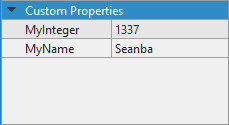
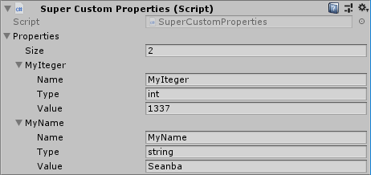
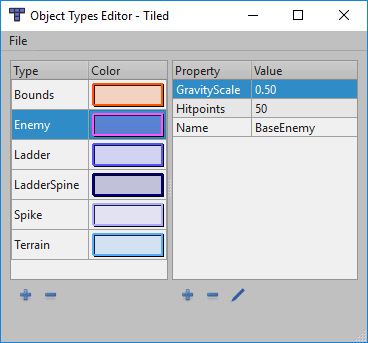
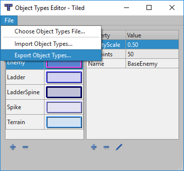
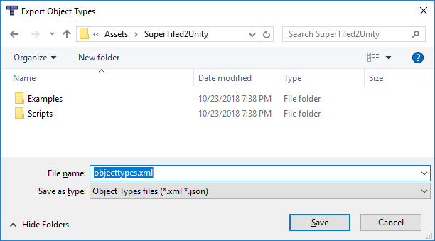
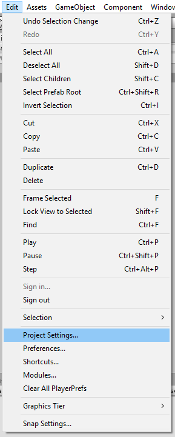
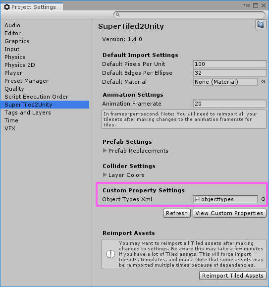
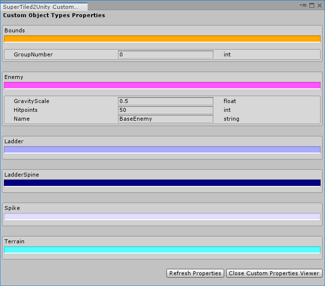

Custom Properties Support
=========================

The `Tiled Map Editor <https://www.mapeditor.org/>`__ has support for `Custom Properties <http://doc.mapeditor.org/en/stable/manual/custom-properties/>`__
that allow you to include custom data or information along with components of your map.

   
   Tiled Custom Properties

These custom properties are also **supported by SuperTiled2Unity** and can be found on the :code:`SuperCustomProperties` Monobehaviour component when imported in your Unity project.

   
   SuperTiled2Unity Custom Properties

Object Types Support
--------------------

Tiled also has *predefined* properties that are described through the 
`Object Types Editor <http://doc.mapeditor.org/en/stable/manual/custom-properties/?highlight=object%20type#predefining-properties>`__.

   
   Object Types Editor

This is a time-saving way to create classes or groups of properties. However, by default, SuperTiled2Unity has no way of being aware of these predefined properties.
This can be resolved by **exporting the Object Types Xml file** to your Unity project.

First, select :code:`Export Object Types...` from the :code:`File` menu item.

   
   Select **Export Object Types** from the File menu item

This will bring up the save file dialog. Save your object types Xml file somewhere within your Unity project.

   
   Save Object Types Xml file to your Unity Project

.. tip::
   You can export your Object Types Xml file to any filename but make sure it is somewhere under your Unity project's :code:`Assets` directory.
   This Xml file itself will need to be a Unity asset that is referenced by SuperTiled2Unity's settings.

We now need to make SuperTiled2Unity aware of this exported Object Types Xml file through the :code:`SuperTiled2Unity Project Settings`.
These settings are found with your other project-wide settings (audio, graphics, etc.) through the :code:`Edit -> Project Settings...` menu item.

In the settings window you should see a field for :code:`Object Types Xml`. Either drag and drop your recently exported Object Types Xml filed into this field or use the
asset selector button to select the asset.

   
   Drag and drop your exported object types Xml file into the **Object Types Xml** field

With the Object Types Xml file now set hit the :code:`View Custom Properties` button just below.
This will display the :code:`Custom Object Types Properties` window which lists all the custom object types that were imported as well as their custom properties (if any) and custom color.

   
   Custom properties for object types are displayed in this window.

Now, any in your Unity project that are updated should have these predefined properties in the appropriate :code:`SuperCustomProperties` instances.

.. warning::
   Note that SuperTiled2Unity does not automatically update map assets when changes to the Object Types Xml are made.
   See the :code:`Reimport Tiled Assets` button in the :code:`SuperTiled2Unity Project Settings` inspector if you want to update all Tiled assets in your Unity project.
   **This may take some time** depending on the number and complexity of your Tiled assets, however.
