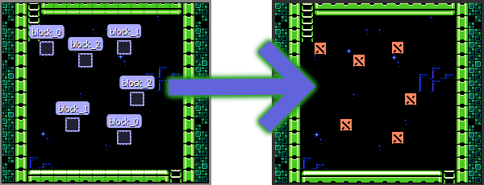

Extending The SuperTiled2Unity Importer
=======================================

**SuperTiled2Unity** strives to build prefabs out of your Tiled maps (\*.txm files) with minimal input from users.
This is achieved  through `Scripted Importers <https://docs.unity3d.com/Manual/ScriptedImporters.html>`_ which was first added with Unity 2017.

Every game is different, however, and for projects of some complexity you'll want to extend the SuperTiled2Unity import pipeline to fit your needs.

SuperTiled2Unity gives you two ways to modify generated prefabs. Once hooked up these modifications will become an integral part of the import process.
This means the same modifications will be applied to your maps automatically, every time you resave in Tiled.

.. tip::
   If you find you have to modify your imported Tiled maps by hand after every save then this is for you. Automating the pipeline saves you time and frustration.

SuperTiled2Unity provides two ways to modify the import pipeline:
 * Prefab Replacements
 * Custom Importers

Prefab Replacements
-------------------

**Prefab Replacements** are the easiest way to modify your imported maps.
In essence, they replace a :code:`Tiled Object` in your map with a :code:`Prefab Instance` based on a prefab in your project.

This `Github Repo <https://github.com/Seanba/SuperPrefabReplacement>`_ explains Prefab Replacements in greater detail and provides a working example.

.. tip::
   **Prefab Replacements** are ideal for spawners.
   Also, any custom properties on your :code:`Tiled Object` with a name that matches a field in your prefab's components will be automatically applied.

Custom Importers
----------------

**Custom Importers** are the most powerful way to modify your imported prefabs.
They give you a place (in code) in the import process where you can completely transform the generated prefab.
This power does come at a cost though as it requires you to write some code.
This may be intimidating to people new to computer programming but if your project requires the kind of specialization afforded by custom importers
then it is highly recommended you invest the time needed to up your coding skills.

.. code-block:: csharp

  // The AutoCustomTmxImporterAttribute will force this importer to always be applied.
  // Leave this attribute off if you want to choose a custom importer from a drop-down list instead.
  [AutoCustomTmxImporter()]
   public class MyTmxImporter : CustomTmxImporter
   {
       public override void TmxAssetImported(TmxAssetImportedArgs args)
       {
           // Note: args.ImportedSuperMap is the root of the imported prefab
           // You can modify the gameobjects and components any way you wish here
           // Howerver, the results must be deterministic (i.e. the same prefab is created each time)
           var map = args.ImportedSuperMap;
           Debug.LogFormat("Map '{0}' has been imported.", map.name);
       }
   }

This `Github Repo <https://github.com/Seanba/SuperMovingPlatform>`_ has a working example of a custom importer (named :code:`TrackCustomImporter`) in action.
It takes a specially-marked :code:`GameObject` and moves it along a track that was drawn in a Tiled map.

.. tip::
   **Custom Importers** requires programming but they provide the ideal way to bend the import pipeline to your will.

