Sorting with SuperTile2Unity
============================

At the map import level, SuperTiled2Unity has two options for sorting the layers (and objects) in your `Tiled Map Editor <https://www.mapeditor.org/>`__ file.

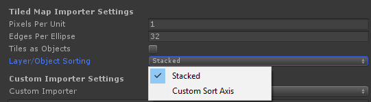

**Sorting Modes**

.. csv-table::
   :widths: auto

   "Stacked", "Default sorting. Matches the rendering order of layers and objects in Tiled."
   "Custom Sort Axis", "Sorting is performed with the help of a Custom Sort Axis (a setting in Unity)."

:code:`Stacked` is a good default for side-scroller games where players and other game objects do not move about the map in ways that change their rendering order.
Overhead-style games may prefer to use the :code:`Custom Sort Axis` setting.
This takes a little more work but will be necessary if you need the rendering order of game objets against tiles to be dynamic.

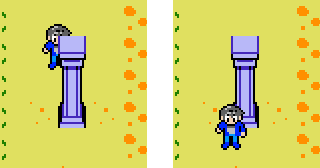
   
   The example that comes with SuperTiled2Unity uses a Custom Sort Axis so that our player can be rendered either in front of or behind these columns depending on his current y-position.

How SuperTiled2Unity Implements Sorting
---------------------------------------

In Unity, render order of sprite and tile assets is generally handled through two settings on the `Sprite Renderer <https://docs.unity3d.com/Manual/class-SpriteRenderer.html>`__
and `Tilemap Renderer <https://docs.unity3d.com/Manual/class-TilemapRenderer.html>`__ components:

.. csv-table::
   :widths: auto

   "Sorting Layer", "Name of sorting layer. See the `Tag Manager <https://docs.unity3d.com/Manual/class-TagManager.html>`__ to manage these."
   "Order in Layer", "How the renderer is sorted in the named layer."

SuperTiled2Unity performs sorting almost primarily through manipulating the :code:`Order in Layer` setting of the prefab components it creates during import.
By default, all tile layers use the Unity's built-in :code:`Default` sorting layer with ever increasing :code:`Order in Layer` values.

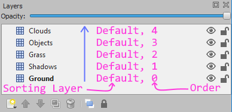
   
   Higher layers in Tiled use higher :code:`Order in Layer` values in Unity so that rendering order is preserved.

Most Unity projects, however, will have several custom :code:`Sorting Layers` that we want a mix of tiles and sprites to share.
In these cases, a specifically-named custom property, :code:`unity:SortingLayer`, will direct SuperTiled2Unity further on how sorting fields are assigned.

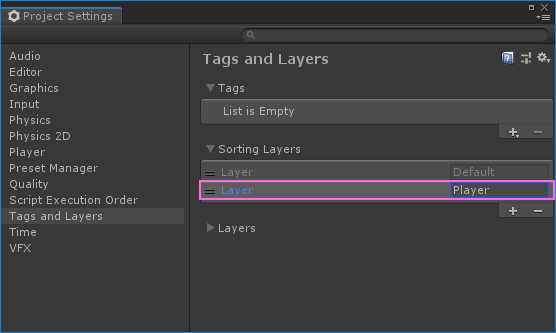

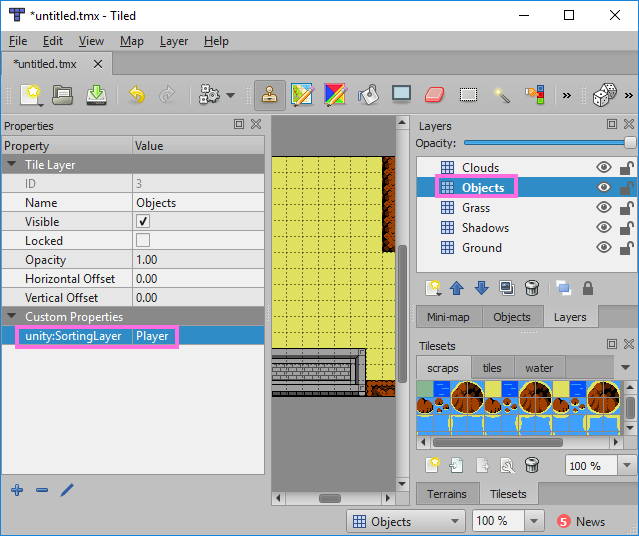

This will result in our :code:`Objects` tile layer breaking the chain of :code:`Default` sorting layers.

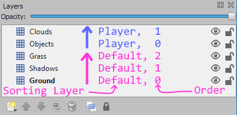

Note that the :code:`Clouds` layer will still be rendered on top of the :code:`Objects` layer.
You may wish to use yet another :code:`unity:SortingLayer` for clouds to make it more explicit that these tiles are drawn on top of other tiles and sprites.

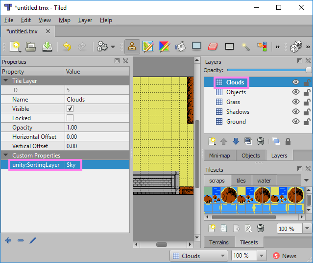

Now the cloud tiles will be rendered in order but on a sorting layer that is more aptly named for them and other tiles that may always appear above our map.

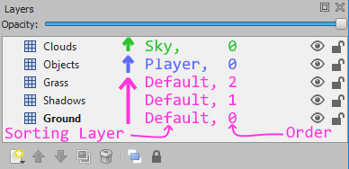

.. tip::
   It takes a bit of work but in general it is a good idea to be explicit about what layers (in Tiled) are assigned to which sort layer (in Unity).
   Using the :code:`unity:SortingLayer` in concert with Unity Sorting Layers *early* makes it easier to make sweeping sorting changes *later*.

Tile Objects and Sorting
------------------------
Tiled allows you to place tiles in a an `object layer <http://doc.mapeditor.org/en/stable/manual/layers/#object-layers>`__ as separate tile objects.
During import, Tiled2Unity turns these tile objects into sprites that are not part of any :code:`Tilemap`.
If you import your map with the :code:`Stacked` sorting mode then these sprites will also be assigned a sort order.

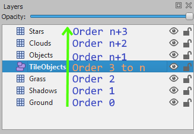

This may make it difficult to predict what sorting order is assigned to the layer that comes after :code:`TileObjects` as it depends on the number of objects in that group.
Using a custom property to set the sorting layer name on the next layer will help.
(Note that for the :code:`Custom Sort Axis` sort mode that each imported sprite is not assigned an incrememted sorting order as they will be sorted by their y-position instead.)

Dynamic Sorting with a Custom Sort Axis
---------------------------------------
Games with an overhead view often have sprites that need to alter their rendering order with tile maps as they move around.
The classic example is a sprite that may appear either in-front-of or behind a column based on their y-position.

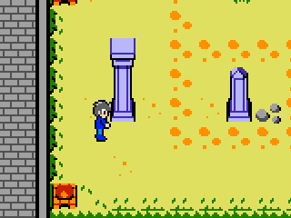
   
   The :code:`overhead` scene included with SuperTiled2Unity may serve as a useful guide for others trying to achieve this effect.

In order to use custom axis sorting follow these three steps:

* Import your map with the :code:`Custom Sort Axis` sort mode
* Modify :code:`Transparency Sort Mode` and :code:`Transparency Sort Axis` in your Unity Project Settings to sort against an axis with increasing y-value.
* Make sure your sprites (Unity) and tiles (Tiled) *that you want to sort dynamically* are assigned the same :code:`Sorting Layer` and :code:`Order in Layer` values. (This is the most common source of errors.)

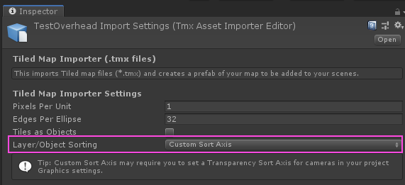

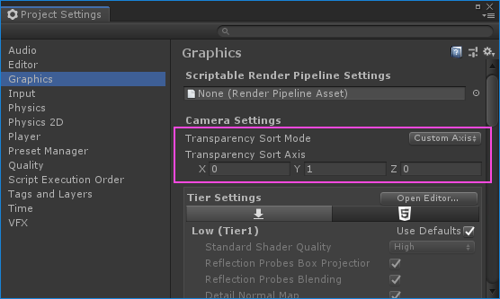

.. tip::
   Objects to be dynamically sorted by a Custom Sort Axis will need to have the same :code:`Sorting Layer` and :code:`Order in Layer` values of the tiles they are sorting against.

Note that you can also set the :code:`Transparency Sort Axis` in script if you wish.

.. code:: C#

   var camera = GameObject.FindGameObjectWithTag("MainCamera").GetComponent<Camera>();
   camera.transparencySortMode = TransparencySortMode.CustomAxis;
   camera.transparencySortAxis = Vector3.up;
